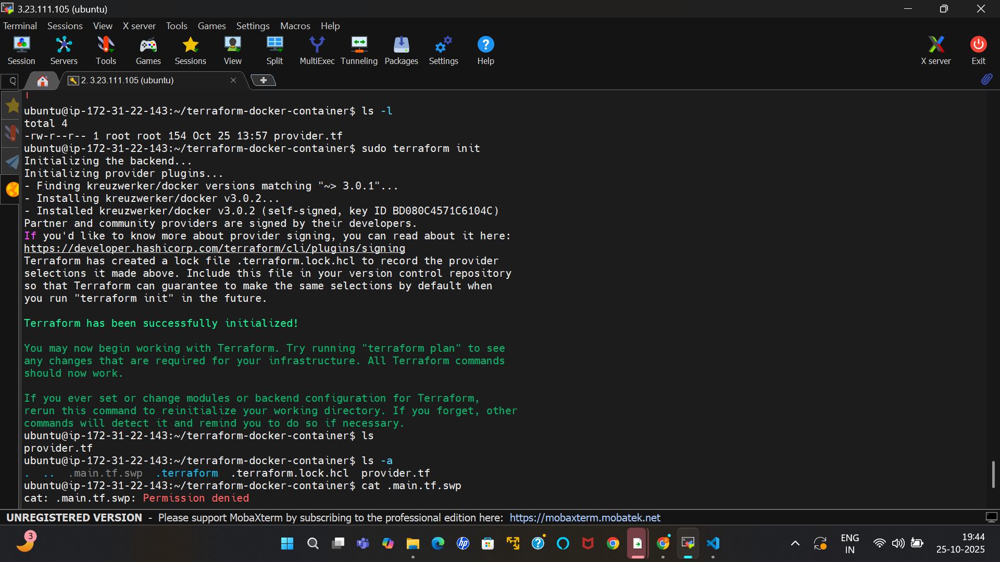
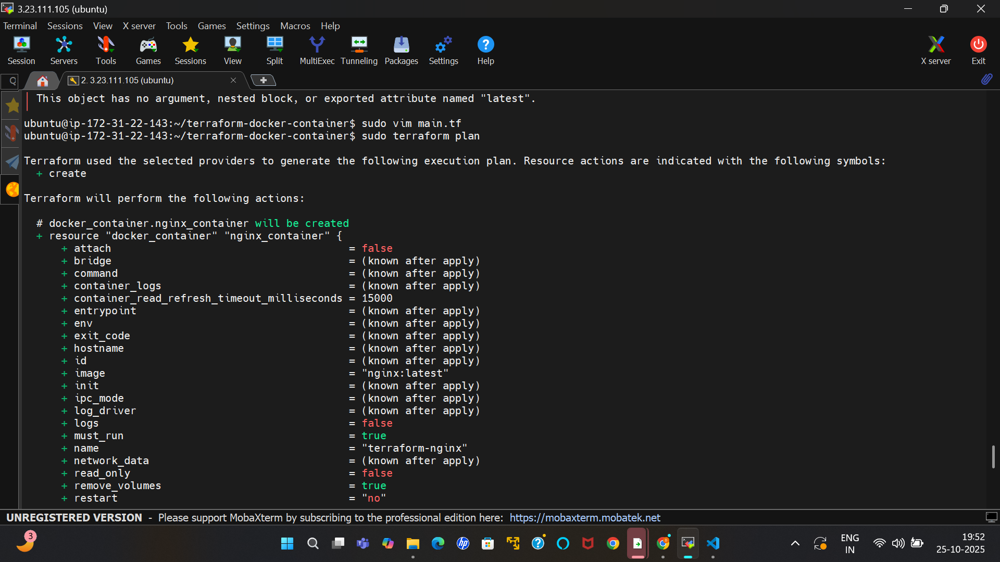
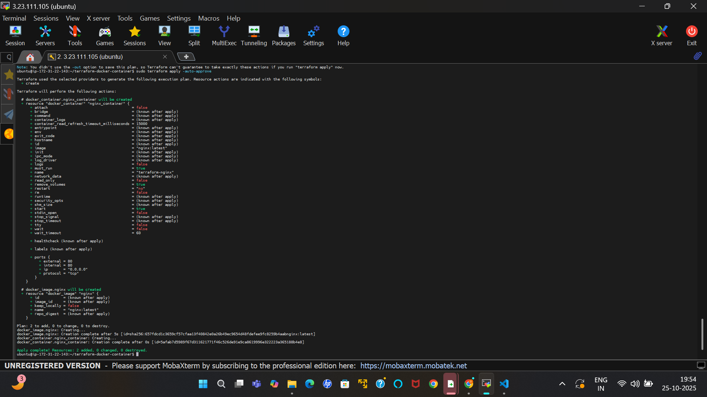
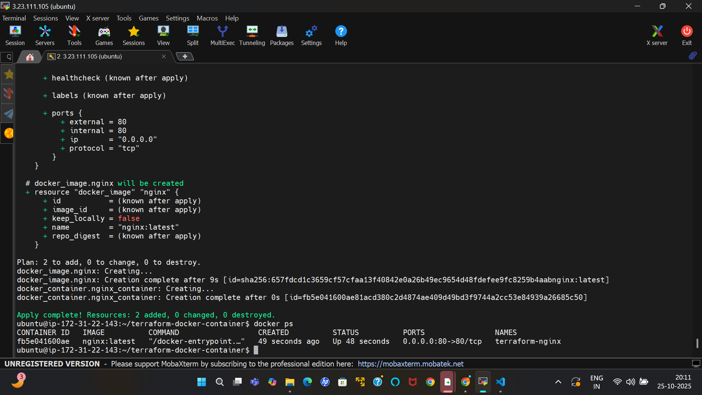
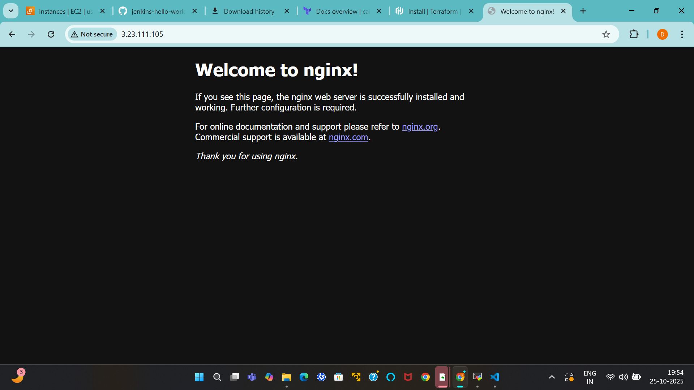
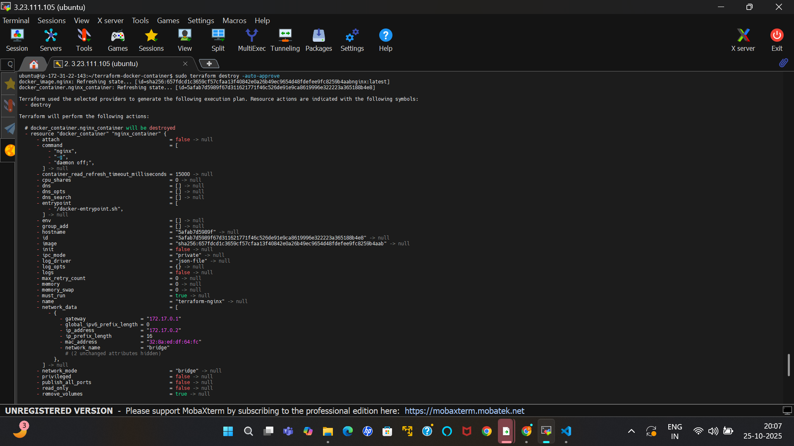

# 🚀 DevOps Internship – Task 4: Terraform Docker Container

## 🎯 Objective

Provision a Docker container using Terraform to understand Infrastructure as Code (IaC) and practice Terraform commands (`init`, `plan`, `apply`, `destroy`).

---

## 🧰 Tools Used

* Terraform – Infrastructure as Code tool  
* Docker – Containerization platform  

---

## 🏗️ Setup Instructions

### 1️⃣ Install Terraform

Ubuntu:

sudo apt update
sudo apt install -y gnupg software-properties-common curl
curl -fsSL https://apt.releases.hashicorp.com/gpg | sudo gpg --dearmor -o /usr/share/keyrings/hashicorp-archive-keyring.gpg
echo "deb [signed-by=/usr/share/keyrings/hashicorp-archive-keyring.gpg] https://apt.releases.hashicorp.com $(lsb_release -cs) main" | sudo tee /etc/apt/sources.list.d/hashicorp.list
sudo apt update
sudo apt install terraform -y

terraform -v

### 1️⃣ Install Docker

Ubuntu:

sudo apt update
sudo apt install -y docker.io
sudo systemctl enable docker
sudo systemctl start docker
docker --version

Make sure your user can run Docker commands:
sudo usermod -aG docker $USER
newgrp docker

1. Initialize Terraform

cd ~/terraform-docker-container

terraform init

2. Plan Infrastructure

terraform plan

3. Apply Terraform Changes

terraform apply -auto-approve

4. Verify Docker Container

docker ps

. Container should be running on port 80

. Access Nginx: http://localhost:80/

7. Destroy Infrastructure

terraform destroy -auto-approve

🔄 Workflow Summary

. terraform init – Initializes Terraform and downloads providers

. terraform plan – Shows what resources Terraform will create

. terraform apply – Creates the Docker container

. docker ps – Verify container is running

. terraform destroy – Cleans up container and image

✅ Outcome

. Provisioned and managed Docker containers using Terraform

. Practiced Terraform commands: init, plan, apply, destroy

. Learned IaC concepts and Docker integration

